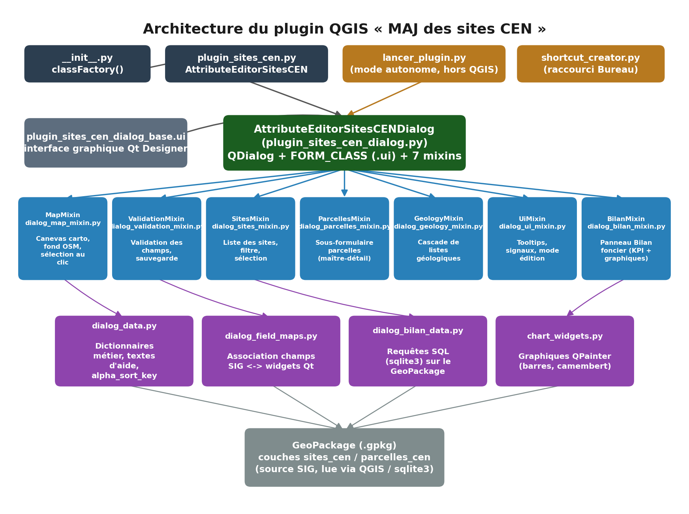
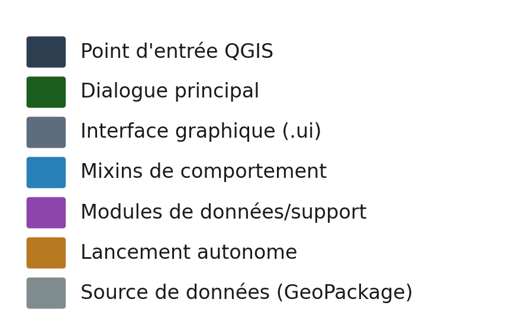

🌿 Plugin QGIS : Gestionnaire des sites CEN Pays de la Loire

Ce plugin permet la consultation et la mise à jour simplifiée des données attributaires des sites naturels gérés par le CEN Pays de la Loire. Il offre une interface ergonomique pour garantir la cohérence des données saisies par les agents.

=> Lien du dépôt GitHub : https://github.com/matthieu-cen-paysdelaloire/plugin-sites-cen.git

=> Version : 2.1 (2026)

=> Nouveautés : 
    - Répartition du formulaire des sites en différents onglets et sous-onglets
    - Création d'un vusel cartographique interactif
    - Ajout d'un second formulaire de saisie pour la visualisation de la table parcelles_cen 
    - Création d'un boutton d'activation/désactivation du mode édition
    - Création d'un onglet pour dresser un bilan foncier onteractif en fonction de l'année voulue
    - Création d'un boutton permettant la mise en place d'un raccourci sur le bureau de l'utilisateur

=>  Structure des fichiers : 

=>  Prérequis sur les données (Couche SIG)

  Pour fonctionner, les 2 tables SIG requises, dans le GeoPackage, doivent impérativement s'appeler 'sites_cen' et 'parcelles_cen'.

=>  Maintenance et Évolutions :

  Modifier les listes déroulantes :
  - Toutes les valeurs des menus (Combo Boxes) sont centralisées dans les dictionnaires au début de la classe AttributeEditorSitesCENDialog. Pour ajouter ou modifier une option, intervenez directement dans le fichier plugin_sites_cen_dialog.py.

  Ajout de nouveaux champs : 
  - Pour intégrer un nouveau champ de saisie, créez le widget dans Qt Designer (.ui), puis ajoutez simplement une entrée dans le dictionnaire self.field_map du fichier ..._dialog.py en associant le nom du champ SIG à la variable du widget (ex: "mon_champ_sig": self.monNouveauWidget).

  Arbre de décision Géologique : 
  - Le système de cascade est piloté par le dictionnaire self.dict_geol_step. Sa structure imbriquée permet de modifier l'arbre de décision sans toucher à la fonction de calcul du code.

=>  Installation manuelle :

    Copier le dossier du plugin dans le répertoire des extensions QGIS :

    %AppData%\Roaming\QGIS\QGIS3\profiles\default\python\plugins

    Activer l'extension dans QGIS : Extensions > Installer/Gérer les extensions.

=>  Développeur : Matthieu Goubert

=>  Organisation : Conservatoire d'Espaces Naturels - Pays de la Loire

=> Compatibilité / prérequis techniques : 
    - qgisMinimumVersion = 3.16
    - qgisMaximumVersion = 4.99
