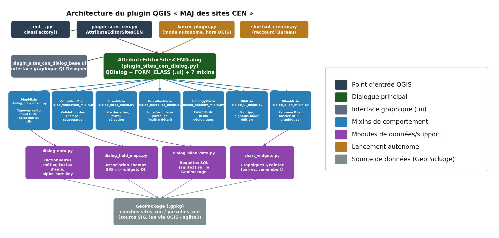

🌿 Plugin QGIS : Gestionnaire des sites CEN Pays de la Loire

Ce plugin permet la consultation et la mise à jour simplifiée des données attributaires des sites naturels gérés par le CEN Pays de la Loire. Il offre une interface ergonomique pour garantir la cohérence des données saisies par les agents.

=> Lien du dépôt GitHub : https://github.com/matthieu-cen-paysdelaloire/plugin-sites-cen.git

=> Version : 2.1 (2026)

=> Nouveautés :\
    - Répartition du formulaire des sites en différents onglets et sous-onglets\
    - Création d'un vusel cartographique interactif\
    - Ajout d'un second formulaire de saisie pour la visualisation de la table parcelles_cen\
    - Création d'un boutton d'activation/désactivation du mode édition\
    - Création d'un onglet pour dresser un bilan foncier onteractif en fonction de l'année voulue\
    - Création d'un boutton permettant la mise en place d'un raccourci sur le bureau de l'utilisateur

=>  Structure des fichiers : 

=>  Prérequis sur les données (Couche SIG)

  Pour fonctionner, les 2 tables SIG requises, dans le GeoPackage, doivent impérativement s'appeler 'sites_cen' et 'parcelles_cen'.

=> Maintenance et Évolutions :

Modifier les listes déroulantes :

* Toutes les valeurs des menus (Combo Boxes) sont centralisées dans le fichier dialog_data.py, sous forme de dictionnaires DICT_... (ex : DICT_TYPE_MILIEU, DICT_OUI_NON). Chaque entrée associe le libellé affiché à l'utilisateur à la valeur enregistrée dans la table SIG (ex : "Pelouses sèches": "2"). Pour ajouter ou modifier une option, il suffit d'intervenir dans le dictionnaire concerné. La première entrée "-- À renseigner --" correspond à une valeur vide (NULL) et doit être conservée en tête de chaque dictionnaire.

* Chaque liste déroulante est reliée à son propre dictionnaire dans la fonction build_combo_dicts() du fichier dialog_field_maps.py. Pour créer une nouvelle liste déroulante, ajoutez son dictionnaire dans dialog_data.py, puis déclarez l'association "widget -> dictionnaire" dans build_combo_dicts().

Ajout de nouveaux champs :

* Pour intégrer un nouveau champ de saisie, créez le widget dans Qt Designer (plugin_sites_cen_dialog_base.ui), puis ajoutez une entrée dans la fonction build_field_map() du fichier dialog_field_maps.py, en associant le nom du champ SIG au widget (ex : "mon_champ_sig": dlg.monNouveauWidget).

* Selon le type de champ, une étape supplémentaire peut être nécessaire :\
  - liste déroulante : déclarer également son dictionnaire (voir "Modifier les listes déroulantes")\
  - date facultative : associer le champ date à sa case à cocher "Non renseignée" dans build_date_null_checkboxes()\
  - champ en lecture seule (site) : utiliser build_site_readonly_field_map() au lieu de build_field_map()\
  - champ des parcelles : utiliser build_parcelle_field_map().

* Pour ajouter une infobulle d'aide (❓) à côté du nom d'un champ, ajoutez une entrée dans le dictionnaire HELP_TEXTS du fichier dialog_data.py. La clé correspond au nom (objectName) du label dans le fichier .ui.

Arbre de décision Géologique :

* Le système de cascade est piloté par le dictionnaire DICT_GEOL_STEP du fichier dialog_data.py. Sa structure imbriquée permet de modifier l'arbre de décision sans toucher à la fonction de calcul du code (dialog_geology_mixin.py). Chaque niveau du dictionnaire correspond à une liste déroulante, et chaque branche se termine par la valeur du code à enregistrer.

* L'arbre peut compter au maximum 4 niveaux (4 listes déroulantes). Chaque niveau doit commencer par l'entrée "-- À renseigner --": "".

Fonds de plan de la carte :

* La carte du formulaire propose plusieurs fonds de plan, que l'utilisateur choisit via le bouton "🗺️ Fond de plan" situé en haut à droite de la carte : Plan OpenStreetMap, Photographies aériennes (IGN), Plan IGN, ou mode Automatique (plan OSM en vue d'ensemble, photographies aériennes IGN en vue rapprochée). Le dernier choix de l'utilisateur est mémorisé d'une ouverture à l'autre.

* Toute la gestion de la carte est regroupée dans le fichier dialog_map_mixin.py. Pour ajouter un nouveau fond, il suffit d'ajouter une entrée dans le dictionnaire BASEMAPS (libellé, URL des tuiles, niveaux de zoom, mention des sources). Il apparaîtra automatiquement dans le menu.

* L'échelle à partir de laquelle le mode Automatique bascule sur les photographies aériennes se règle via la constante AUTO_SWITCH_SCALE (1:10 000 par défaut).

* Les fonds IGN proviennent de la Géoplateforme (data.geopf.fr), en accès libre et sans clé. Une connexion internet est nécessaire. Si un fond est indisponible, la carte revient automatiquement sur OpenStreetMap.

=>  Installation manuelle :

    Copier le dossier du plugin dans le répertoire des extensions QGIS :

    %AppData%\Roaming\QGIS\QGIS3\profiles\default\python\plugins

    Activer l'extension dans QGIS : Extensions > Installer/Gérer les extensions.

=>  Développeur : Matthieu Goubert

=>  Organisation : Conservatoire d'Espaces Naturels - Pays de la Loire

=> Compatibilité / prérequis techniques :\
    - qgisMinimumVersion = 3.16\
    - qgisMaximumVersion = 4.99
